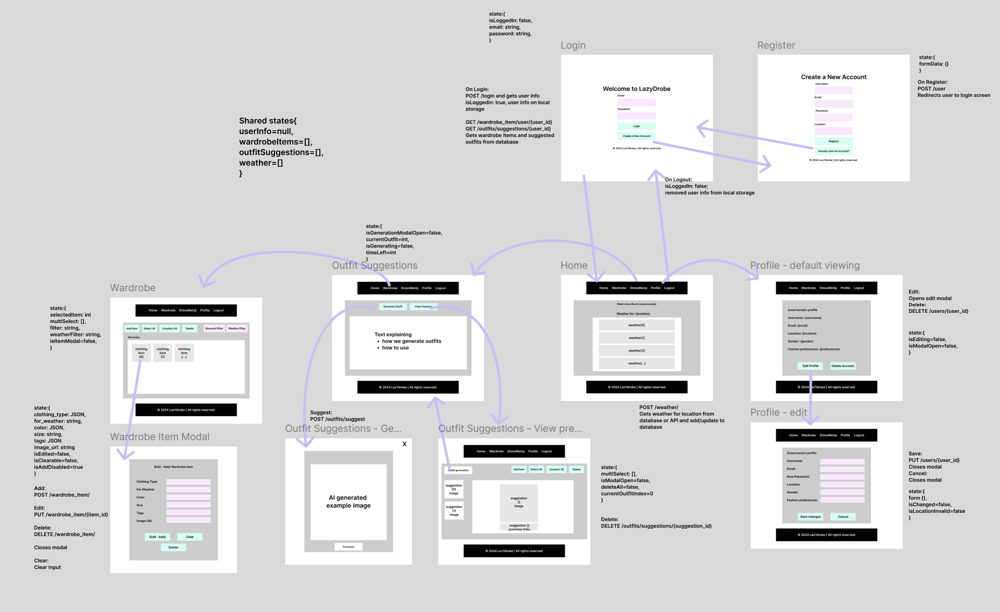

# Frontend Guide - LazyDrobe
This guide provides instructions on how to set up, run, and understand the front-end code for the LazyDrobe wardrobe management app. This initial version covers setting up a basic prototype with core components, layout styling, and mock data.

## Objective
The current goal is to develop the front-end architecture of LazyDrobe. This prototype includes major components and layout styling, using mock data to simulate an API. These components are designed to be flexible and scalable, preparing for future API integration.

## Wireframe


[Figma](https://www.figma.com/design/9YrdLFshQqQMIgmeGvPYMK/Figma-basics?node-id=825-2&t=loE2LRUpFeCN9x6I-1)

## Prerequisites
Before running this code, ensure you have the following installed:

Node.js (version 14.x or higher)
npm (included with Node.js) 

## Getting Started
Follow these steps to set up and run the front-end code on your local machine.

### 1. Clone the Repository
Clone the repository to your local machine:

```
git clone https://github.com/Anantesh-Mohapatra/LazYdrobe-Online
```
Note: Replace username with your GitHub username if you forked the repository.

### 2. Navigate into the Project Directory
Change to the project’s directory:
```
cd  path/to/LazYdrobe-Online
```
### 3. Install Dependencies
Install the necessary packages using npm:
```
npm install
npm install react
npm install react-scripts
npm install react-router-dom
npm install react-modal
npm install react-toastify
npm install react-icons
```

### 4. (Skip if already done) Set up the backend
#### a. Clone the Repository
If not already cloned:
```
git clone https://github.com/abd-abdur/LazYdrobe.git
```
#### b. Navigate to the Project Directory
In a separate tab, navigate to the project's backend directory:
```
cd  path/to/LazYdrobe
```
#### c. Set Up a Virtual Environment
(Optional) Recommended to use a virtual environment to isolate project dependencies
```
python -m venv .venv
```

Activate the virtual environment:
On Windows: 
```
.\.venv\Scripts\activate
```
On macOS/Linux: source 
```
.venv/bin/activate
```
#### d. Install Required Dependencies
Install the required packages from the requirements.txt file.
```
pip install -r requirements.txt
```


### 5. Run the backend

Use the following command to start the application:
```
uvicorn main:app --reload
```

### 6. Start the Application
Start the development server:
```
npm start
```
After starting, the app should open automatically in your browser at http://localhost:3000. If it doesn’t, open the link manually.

## Project Structure
Here's an overview of the project directory structure:

```
lazydrobe/
├── public/
│   └── index.html                       # Main HTML file for the React app
├── src/  
│   ├── components/                        # All React components
│   │   ├── profile/                       # Profile components and relevant css
│   │   │   ├── Profile.js                 # Profile page screen
│   │   │   ├── ProfileEdit.js             # Profile page segment 
│   │   │   ├── ProfileView.js             # Profile page segment
│   │   ├── styling/                       # All React components' CSS files
│   │   ├── suggestion/                    # Outfit suggestion components and relevant css
│   │   │   ├── OutfitGenerationModal.js   # Component to view new generated outfit
│   │   │   ├── PreviousOutfitControls.js  # Component for deleting custom outfits
│   │   │   ├── PreviousOutfitItem.js      # Individual outfit suggestion items
│   │   │   ├── PreviousOutfitPreviews.js  # Suggestion outfit preview image
│   │   ├── wardrobe/                      # Wardrobe components and relevant css
│   │   │   ├── CustomOutfitControl.js     # Component for adding, filtering, and deleting custom outfits
│   │   │   ├── CustomOutfitModal.js       # Modal component for adding/editing custom outfits
│   │   │   ├── CustomOutfitSection.js     # Custom Outfits display component
│   │   │   ├── OutfitModal.js             # Old modal component for adding/editing custom outfits
│   │   │   ├── WardrobeControls.js        # Component for adding, filtering, and deleting wardrobe items
│   │   │   ├── WardrobeItem.js            # Individual wardrobe item component
│   │   │   ├── WardrobeItemModal.js       # Modal component for adding/editing wardrobe items
│   │   │   ├── WardrobeSection.js         # Wardrobe item display component
│                                          
│                                          # Main components:
│                                          
│   │   ├── Login.js                       # Login page screen
│   │   ├── Register.js                    # Register page screen
│   │   ├── Navbar.js                      # Navigation bar component
│   │   ├── Home.js                        # Home page screen
│   │   ├── FiveDayWeather.jsx             # Weather component
│   │   ├── Wardrobe.js                    # Main wardrobe page screen
│   │   ├── OutfitSuggestions.js           # Main DressMeUp page screen
│   │   ├── PreviousOutfit.js              # View previous outfit suggestion screen
│   │   ├── Footer.js                      # Footer component
│   │   ├── LoadingPopup.js                # Component for showing loading
│   │   ├── ErrorBoundary.js               # Component for showing error
│   ├── App.js                             # Main app component with routes and functions
│   ├── index.js                           # Entry point to render the app
│   └── App.css                            # Unified styling for all components
├── .gitignore                             # Excludes unnecessary files from Git
├── README.md                              # General project overview and instructions
├── package.json                           # Lists dependencies and scripts
├── package-lock.json                      # Locks dependencies to specific versions
```
## Key Components
The following core components were identified in the wireframe and are implemented in this prototype:

 - **Login** (`Login.js`): Displays the login screen for the app.  
 - **Home** (`Home.js`): Displays the home screen for the app.  
    - **FiveDayWeather** (`FiveDayWeather.jsx`): Shows a five-day weather forecast.
 - **Navbar** (`Navbar.js`): Displays the navigation links for the app.  
 - **Footer** (`Footer.js`): Shows copyright information.  
 - **Wardrobe** (`Wardrobe.js`): Displays wardrobe items with filtering functionality.  
   - **WardrobeModal** (`WardrobeModal.js`): Modal for adding/editing wardrobe items.
 - **OutfitSuggestions** (`OutfitSuggestions.js`): Page to access outfit suggestion and viewing previous suggestions. 
   - **OutfitGenerationModal** (`OutfitGenerationModal.js`): Displays newly generated outfit suggestion.
   - **PreviousOutfit** (`PreviousOutfit.js`): Page to show and manage previously generated outfits.
 - **Profile** (`Profile.js`): Allows users to view and edit their profile information.
   - **ProfileEdit** (`ProfileEdit.js`): Component for editing user information.
   - **ProfileView** (`ProfileView.js`): Component for viewing user information.
   

These components are designed based on the hierarchy and interaction flows from the wireframe.

## Styling
All component styles have their own css files, located in the src/components/styling folder or in respective folder. The styling is focused on layout rather than aesthetics, using a clean and minimal design to emphasize functionality over appearance.

## API Integration

The frontend interacts with the backend API to perform CRUD operations and fetch data. Axios is used for making HTTP requests.

### Endpoints Used

#### User Authentication
- **POST** `/users/`: Register a new user.
- **POST** `/login`: Authenticate a user.
- **GET** `/users/{user_id}`: Retrieve user information.
- **PUT** `/users/{user_id}`: Update user information.
- **DELETE** `/users/{user_id}`: Delete a user account.

#### Wardrobe Management
- **POST** `/wardrobe_item/`: Register a new wardrobe item.
- **GET** `/wardrobe_item/user/{user_id}`: Retrieve wardrobe items of an user.
- **GET** `/wardrobe_item/{item_id}`: Retrieve wardrobe item information.
- **PUT** `/wardrobe_item/{item_id}`: Update wardrobe item information.
- **DELETE** `/wardrobe_item/{item_ids}`: Delete a list of wardrobe item(s).

#### Weather Data
- **POST** `/weather/`: Fetch weather data for a given location from API or database.

#### Custom Outfit Management
- **POST** `/outfit/`: Register a new outfit.
- **GET** `/outfit/user/{user_id}`: Retrieve outfits of an user.
- **PUT** `/outfit/{item_id}`: Update outfit information.
- **DELETE** `/outfit/{item_id}`: Delete an outfit.

#### Outfit Suggestion Management
- **POST** `/outfits/suggest`: Register a new outfit suggestion.
- **GET** `/outfits/suggestions/{user_id}`: Retrieve outfit suggestions of an user.
- **DELETE** `/outfits/suggestions/all`: Delete all outfit suggestions.
- **DELETE** `/outfits/suggestions/`: Delete a list of outfit suggestion(s).

### Handling API Calls

#### Authentication
- Upon successful login, the user's authentication token (if implemented) is stored in local storage or a global context, enabling authenticated requests.

#### CRUD Operations
- **Create**: Forms allow users to add new wardrobe items or e-commerce products.
- **Read**: Data such as wardrobe items, outfit suggestions, and weather data are fetched and displayed.
- **Update**: Forms and modals enable users to edit existing items.
- **Delete**: Buttons trigger item deletion with confirmation prompts.

#### Error Handling
- Capture and display error messages returned from the API.
- Use React's state management to handle errors gracefully, providing a smoother user experience.

#### Loading States
- Display loading indicators while API requests are in progress to enhance user experience and inform users of background operations.

### Example API Call: Fetch User Data

```javascript
import axios from 'axios';

const fetchUserData = async (userId) => {
  setLoading(true);
  try {
    const response = await axios.get(`${process.env.REACT_APP_BACKEND_URL}/users/${userId}`);
    setUserInfo(response.data);
    setError(null);
  } catch (err) {
    setError(err.response?.data?.detail || err.message);
  } finally {
    setLoading(false);
  }
};
```
### User Interaction

#### Examples of User Interactions Triggering API Calls:

1. **Form Submission to Create New Data**
   - **Component**: `WardrobeModal.js`
   - **Action**: User fills out a form to add a new wardrobe item and submits it.
   - **API Call**: `POST /clothing_items/`

2. **Button Click to Fetch and Display Data**
   - **Component**: `OutfitSuggestions.js`
   - **Action**: User clicks a button to generate outfit suggestions based on current weather.
   - **API Call**: `GET /outfits/` or `POST /weather/`

3. **Search Functionality to Query the Database**
   - **Component**: `Wardrobe.js`
   - **Action**: User enters a search term to filter wardrobe items.
   - **API Call**: `GET /clothing_items/?search=term`

#### Implementation Details:
- **Forms**: Utilize controlled components to handle user input and manage form submissions.
- **Buttons**: Attach event handlers to buttons to trigger API calls.
- **Search Bars**: Implement debounce functionality to optimize search requests.

### Error Handling and Loading States

#### Handling Errors:

**Frontend:**
- Use `try-catch` blocks around API calls to handle potential errors.
- Set error states (e.g., `error`) to store and display error messages to users.

**Example:**

```javascript
import axios from 'axios';
import { useState } from 'react';

const fetchUserData = async (userId) => {
  setLoading(true);
  setError(null); // Clear any previous errors
  try {
    const response = await axios.get(`${process.env.REACT_APP_BACKEND_URL}/users/${userId}`);
    setUserInfo(response.data);
  } catch (err) {
    setError(err.response?.data?.detail || "An unexpected error occurred.");
  } finally {
    setLoading(false);
  }
};

### Displaying Loading States

**Frontend:**
- Manage loading states (e.g., `loading`) using React's `useState` hook.
- Display loading indicators (e.g., spinners or messages) when `loading` is set to `true` to inform users that a process is underway.

**Example:**

```javascript
{loading ? (
  <p>Loading...</p>
) : (
  <div>{/* Render data here */}</div>
)}
```

## Mock Data
To simulate future API integration, we have implemented mock data. This mock data structure will mirror the real data from the backend API, which will eventually be implemented with FastAPI.

Example of Mock Data (located within mockData.js for now):
```
const outfitSuggestions = [
    {
      outfit_id: 1,
      user_id: 1,
      clothings: [1, 2], // Currently refers to wardrobeItems by item_id
      occasion: { type: "casual", season: "winter" },
      for_weather: "cold",
      date_suggested: "2024-03-01T08:30:00",
      source_url: "https://example.com/outfit1"
    },
    {
      outfit_id: 2,
      user_id: 2,
      clothings: [2],
      occasion: { type: "formal", season: "fall" },
      for_weather: "cool",
      date_suggested: "2024-03-02T09:00:00",
      source_url: "https://example.com/outfit2"
    }
  ];
```
The mock data is currently used to display data in the wardrobe, shopping, and outfit suggestions screens.

## Available Scripts

In the project directory, you can run:

- `npm start`: Runs the app in development mode.
- `npm run build`: Builds the app for production to the `build` folder.
- `npm test`: Launches the test runner.
- `npm run eject`: Ejects the app from Create React App configuration. **Use with caution**.

---

## Documentation and Development Process

### Project Description

**LazYdrobe** is a wardrobe management app designed to help users organize clothing, receive outfit suggestions based on weather and fashion trends, and shop for recommended items to fill wardrobe gaps.

### Component Breakdown

Each component is kept separate to maintain a clear hierarchy and separation of concerns. Components are kept simple to allow for rapid iteration and easy integration with the backend API in the next phase.

### Design Decisions

Based on our wireframe, we have broken down the interface into discrete, reusable components (e.g., `Navbar`, `Footer`, `WardrobeItem`) to ensure a scalable structure. Styling has been kept minimal to focus on functionality and layout.

### Technical Choices

- **React**: Selected for its component-based structure, which aligns with our wireframe and layout needs.
- **React Router DOM**: Chosen for client-side routing between different sections of the app.
- **React Modal**: Used to create modal dialogs for adding or editing wardrobe items.
- **Axios**: Utilized for handling HTTP requests to the backend API.

---

## Troubleshooting

- **Dependency Issues**: If you encounter issues during `npm install`, ensure you have the latest version of Node.js and npm installed.
- **Development Server**: If the app doesn’t load in the browser, confirm that the development server is running on [http://localhost:3000](http://localhost:3000) and that no other app is using this port.
- **API Integration Issues**: Ensure that the backend server is running and that the `REACT_APP_BACKEND_URL` is correctly set in the `.env` file.

---

## AI Usage

AI tools were integrated throughout the development process to streamline the structure, efficiency, and maintainability of the project. Here’s how AI contributed specifically:

- **File Organization and Component Structuring**: AI provided guidance on how to organize files in a clean and maintainable folder structure, which helped establish a coherent naming convention and improve the readability of the codebase.

- **Debugging and Code Enhancements**: AI was used to troubleshoot minor issues in JavaScript files, including logic bugs and syntax errors, ensuring the code adheres to best practices in terms of readability and maintainability.

- **Performance Suggestions**: AI analyzed component re-renders and recommended ways to reduce unnecessary rendering, particularly in larger components such as `Wardrobe` and `ECommerce`, thereby enhancing the overall app performance.

- **Best Practices in React**: AI reinforced the best practices for React components, such as the proper use of hooks and context, ensuring a high standard for component reuse and state management.
